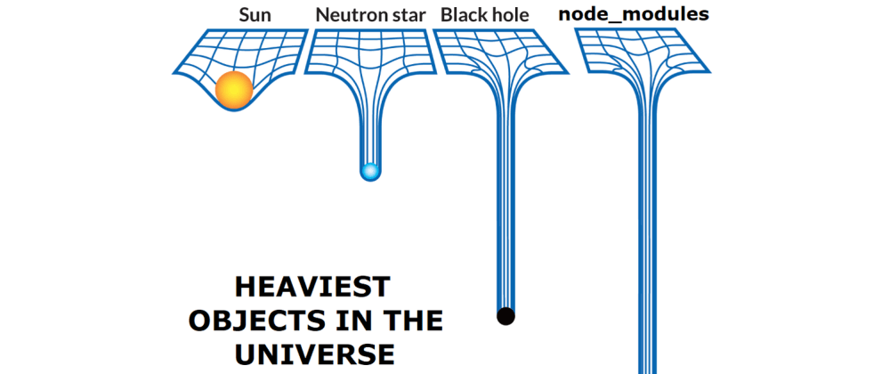

# 1. React의 개발 환경

강의 날짜: 2023년 6월 27일

# JavaScript

- 넷스케이프가 웹페이지를 동적으로 변화시키기 위에 브라우저에 탑재하면서 시작됨

```jsx
<!DOCTYPE HTML>
<html>
  <head>
    <meta http-equiv="Content-Type" content="text/html" charset="UTF-8" />
    <title>자바스크립트 페이지</title>
    <script type="text/javascript">
			document.write("<p>Hello World!</p>");
		</script>
  </head>
  <body>
    <noscript>
      <p>브라우저가 자바스크립트 기능을 지원하지 않거나 자바스크립트 기능이 꺼져 있습니다.</p>
    </noscript>
  </body>
</html>
```

- V8 엔진: 크롬에 탑재된 자바스크립트 엔진(인터프리터)

### ECMAScript

- ECMA International에 의해 표준화된, JavaScript의 기반이 되는 스크립팅 언어 명세
- ES5, ES6
- `var`, `const`

# Node.js

- V8으로 빌드된 이벤트 기반 자바스크립트 런타임
- create next-app, 개발 서버 실행, 빌드 등

# NPM, Yarn

- Node.js의 패키지 관리자
- 패키지: 라이브러리 또는 모듈, React 앱 하나도 하나의 패키지 (또는 하나 이상)
    - 파일과 디렉토리, 메타데이터를 설명하는 `package.json` 으로 구성
    - name, version, private, scripts, dependencies, devDependencies

### NPM

1. 온라인 플랫폼: npm 레지스트리에 패키지를 게시하고 설치하기
2. CLI
- `npm install @toss/react`
- `npm install --save-dev eslint`
- `npm instal`
- `yarn add @toss/react`
- `yarn add -D eslint`
- `yarn`

### Yarn

- 페이스북에서 개발



- [https://toss.tech/article/node-modules-and-yarn-berry](https://toss.tech/article/node-modules-and-yarn-berry)
- 더 빠른 패키지 설치 가능

# Babel, SWC

- 트랜스파일러
- 최신 스펙이 구형 브라우저에서도 돌아갈 수 있도록 변환
- build시에 수행

# Webpack, ESBuild, Vite, **Turbopack** …

- 번들러
- 브라우저에서 사용할 수 있도록 JavaScript 파일을 번들로 묶는 것

# Next.js

- [https://nextjs.org/](https://nextjs.org/)

